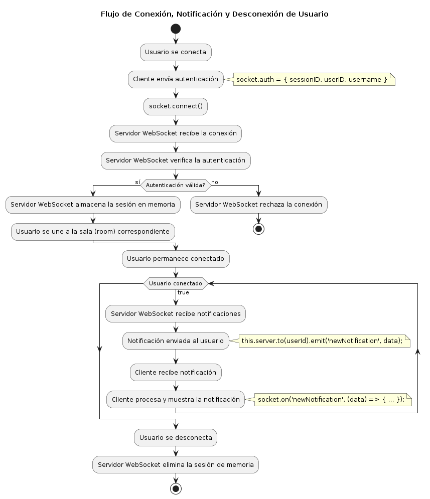

# WS-POC

Este proyecto es un backend desarrollado en [NestJS](https://docs.nestjs.com/) que sirve tanto para WebSockets como para APIs REST. Utiliza [Socket.IO](https://socket.io/get-started/) para la comunicación en tiempo real y cuenta con un sistema de notificaciones que se envían a través de WebSockets. También implementa un sistema de sesiones en memoria para manejar la conexión y desconexión de los usuarios.

## Estructura del Proyecto

```plaintext
src/
├── features/
│   ├── notification/
│   │   ├── controllers/
│   │   │   ├── notification.controller.ts
│   │   ├── core/
│   │   │   ├── dto/
│   │   │   │   ├── confirm-notification.dto.ts
│   │   │   │   ├── send-notification.dto.ts
│   │   ├── events/
│   │   │   ├── notification.gateway.ts
│   │   ├── services/
│   │   │   ├── notification.service.ts
│   │   ├── notification.module.ts
│   ├── middlewares/
│   │   ├── gateway.middleware.ts
│   ├── stores/
│   │   ├── session.store.ts
├── app.controller.ts
├── app.module.ts
├── events.gateway.ts
├── events.module.ts
├── main.ts
```
## Flujo

## Instalación

Sigue estos pasos para instalar y ejecutar el proyecto:

### Clonar el repositorio
```bash
  git clone https://github.com/fernando-alfonso-itti/ws-template.git
  cd ws-poc
```

### Instalar dependencias
```bash
  npm install
```

### Ejecutar el proyecto
```bash
  npm run start:dev
```
    
## Features
- WebSocket.
- Rest API.
- Administrador de Sesión en memoria.
- Mensajes privados.
- Sistema de notificación.

### WebSockets
El proyecto utiliza Socket.IO para manejar la comunicación en tiempo real. Cada usuario se conecta a una sala única (room) basada en su ID de usuario. Esto permite enviar notificaciones específicas a usuarios individuales.

#### Conexión del cliente
El cliente debe enviar la siguiente información al conectarse:
```javascript
socket.auth = {
    sessionID: data.id, //string requerido
    userID: user.id, //string requerido
    username: user.email, // string requerido
};
socket.connect();
```

#### Manejo de notificaciones
Para manejar las notificaciones, el cliente debe suscribirse al evento **newNotification**:
```javascript
socket.on('newNotification', (data) => {
    //hacer algo con la nueva notificación
});
```
El parametro **data** tiene la siguiente estructura:

```typescript
{
    message: string,
    userId: string
}
```

### Rest API
El proyecto también expone endpoints REST que permiten interactuar con las funcionalidades del backend.

#### Ejemplo de endpoint
El endpoint para enviar notificaciones recibe parámetros como el ID del usuario y el mensaje. El controlador recibe estos parámetros y los pasa al servicio, que se encarga de enviar la notificación al usuario en la sala correspondiente.

##### La estructura del DTO es la siguiente:
```typescript
{
    message: string,
    userId: string
}
```
##### El controlador recibe la llamada del endpoint:
```typescript
// src\features\notification\controllers\notification.controller.ts

import { Body, Controller, Post, ValidationPipe } from "@nestjs/common";
import { ApiTags } from "@nestjs/swagger";
import { SendNotificationDto } from "../core/dto/send-notification.dto";
import { NotificationService } from "../services/notification.service";

@ApiTags("notification")
@Controller("notification')
export class NotificationController {
    constructor(private readonly notificationService: NotificationService) {}

    @Post('/send')
    async send(
        @Body(new ValidationPipe()) sendNotificationDto: SendNotificationDto,
    ) {
        await this.notificationService.sendNotification(sendNotificationDto);
        return {
            message: 'Notification sent successfully',
        };
    }
}

```
##### El servicio recibe la responsabilidad de enviar la notificación:
```typescript
// src\features\notification\services\notification.service.ts
import { Injectable } from '@nestjs/common';
import { Server } from 'socket.io';
import { SendNotificationDto } from '../core/dto/send-notification.dto';
import { ConfirmNotificationDto } from '../core/dto/confirm-notification.dto';

@Injectable()
export class NotificationService {
    private server: Server;

    setServer(server: Server) {
        this.server = server;
    }

    async sendNotification(data: SendNotificationDto) {
        const sended = this.server
            .to(data.userId)
            .emit('newNotification', data);
        if (!sended) {
            throw new Error('Notification not sended');
        }
        // Hacer algo con la notificación enviada
        return sended;
    }
}

```
### Administrador de Sesión en Memoria
Se ha implementado un sistema de sesiones en memoria para manejar la conexión y desconexión de los usuarios. Esto se utiliza para autenticar las conexiones de WebSocket y asegurar que cada usuario esté conectado a su sala correspondiente.
#### El adaptador se maneja en el middleware
```typescript
import { Injectable } from '@nestjs/common';
import { WsException } from '@nestjs/websockets';
import { Socket } from 'socket.io';
import { InMemorySessionStore } from '../stores/session.store';

@Injectable()
export class WsAuthMiddleware {
    constructor(private sessionStore: InMemorySessionStore) {}
    use(socket: Socket, next: (err?: any) => void) {
        console.log('Middleware');
        console.log(socket.handshake.auth);
        const sessionID = socket.handshake.auth.sessionID;
        if (sessionID) {
            const session = this.sessionStore.findSession(sessionID);
            if (session) {
                socket.data.sessionID = sessionID;
                socket.data.userID = session.userID;
                socket.data.username = session.username;
                return next();
            }
        }

        const username = socket.handshake.auth.username;
        const userID = socket.handshake.auth.userID;
        if (!username || !userID) {
            return next(new WsException('Username and userID are required'));
        }

        try {
            socket.data.username = username;
            socket.data.userID = userID;
            socket.data.sessionID = sessionID ?? crypto.randomUUID();
            next();
        } catch (err) {
            next(new WsException('Unauthorized'));
        }
    }
}
```
#### Donde el adaptador se compone de la siguiente clase:
```typescript
import { Injectable } from '@nestjs/common';

export type SocketSession = {
    userID: string;
    username: string;
    connected: boolean;
};

@Injectable()
export class InMemorySessionStore {
    private sessions: Map<string, SocketSession>;

    constructor() {
        this.sessions = new Map<string, SocketSession>();
    }

    findSession(id: string) {
        return this.sessions.get(id);
    }

    saveSession(id: string, session: SocketSession) {
        this.sessions.set(id, session);
    }

    findAllSessions() {
        return [...this.sessions.values()];
    }
}

```
## Recursos relacionados
- [Documentación Nest js](https://docs.nestjs.com/)
- [Documentación Socket.io](https://socket.io/get-started/)

